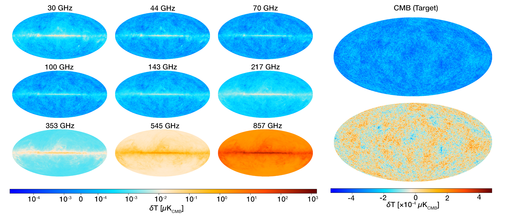
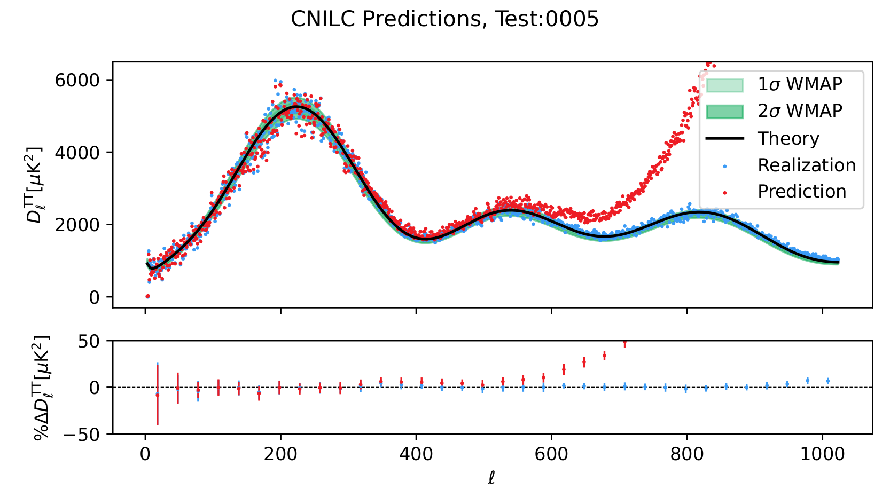

# CMB-ML: A Cosmic Microwave Background Radiation Dataset for Machine Learning

ZENODO (DOI) BADGE HERE

Contents:
- [Quick Start](#quick-start)
- [Introduction](#introduction)
  - [Simulation](#simulation)
  - [Baseline Models](#baseline-models)
  - [Metrics](#metrics)
- [Installation](#installation)
- [Demonstrations](#Demonstrations)
- [Comparing Results](#comparing-results)
  - [Outside Works](#outside-works)
  - [Errata](#errata)
- [Data File Links](#data-file-links)

# Quick Start

To get started:
- Get this repository
- Set up your Python environment
- Create datasets (Downloading is usually an option; contact the authors of the repository if needed)
- Train models
- Run inference
- Compare results

See [Installation](#installation) and [Demonstrations](#Demonstrations) for more detail.


# Introduction


The Cosmic Microwave Background radiation (CMB) signal is one of the cornerstones upon which modern cosmologists understand the universe. The signal must be separated out from these other natural phenomena which either emit microwave signals or change the CMB signal itself. Modern machine learning and computer vision algorithms are seemingly perfect for the task, but generation of the data is cumbersome and no standard public datasets are available. Models and algorithms created for the task are seldom compared outside the largest collaborations. 

The CMB-ML dataset bridges the gap between astrophysics and machine learning. It handles simulation, modeling, and analysis.

Several tools enable this work. [Hydra](https://hydra.cc/) is used to manage manage a pipeline so that coherent configurations are applied consistently. It uses the [PySM3](https://pysm3.readthedocs.io/en/latest/) simulation library in conjunction with [CAMB](https://camb.info/), [astropy](https://www.astropy.org/), and [Healpy](https://healpy.readthedocs.io/en/latest/) to handle much of the astrophysics. Two baselines are implemented, with more to follow. One baseline comes from astrophysics: [PyILC](https://github.com/jcolinhill/pyilc)'s implementation of the CNILC method. The other baseline uses machine learning: [CMBNNCS](https://github.com/Guo-Jian-Wang/cmbnncs)'s UNet8. The analysis portion of the pipeline first puts predictions into a consistent form, then generates summary statistics, and finally compares between models' performances.

## Simulation



The real CMB signal is observed at several microwave wavelengths. To mimic this, we make a ground truth CMB map and several contaminant foregrounds. We "observe" these at the different wavelengths, where each foreground has different levels. Then we apply instrumentation effects to get a set of observed maps.

## Cleaning

Two models are included as baselines in this repository. One is a classic astrophysics algorithm, a flavor of **i**nternal **l**inear **c**ombination methods, which employs **c**osine **n**eedlets (CNILC). The other is a machine learning method (a UNet) implemented and published in the astrophysics domain, CMBNNCS. 

The CNILC method was implemented by [PyILC](https://github.com/jcolinhill/pyilc), and is described in [this paper](https://arxiv.org/abs/2307.01043).

The CMBNNCS method was implemented by [cmbNNCS](https://github.com/Guo-Jian-Wang/cmbnncs), and is described in [this paper](https://iopscience.iop.org/article/10.3847/1538-4365/ac5f4a).

## Analysis

We can compare the CMB predictions to the ground truths in order to determine how well the model works. However, because the models operate in fundamentally different ways, care is needed to ensure that they are compared in a consistent way. We first mask each prediction where the signal is often to bright to get meaningful predictions. We then remove effects of instrumentation from the predictions. The pipeline set up to run each method is then used in a slightly different way, to pull results from each method and produce output which directly compares them. The following figures were produced automatically by the pipeline, for quick review.




Other figures are produced of summary statistics, but these are far more boring (for now!).

# New Methods

If implementing a new machine learning method, we encourage you to first familiarize yourself with Hydra and the content of the tutorial notebooks. After that, look through the [top-level script](main_cmbnncs.py) and executors for CMBNNCS (in `cmbml/cmbnncs_local/stage_executors`). In particular, note how training and prediction follow common PyTorch design patterns ([train](cmbml/cmbnncs_local/stage_executors/D_train.py) and [predict](cmbml/cmbnncs_local/stage_executors/E_predict.py)). The [dataset.py](cmbml/cmbnncs_local/dataset.py) file includes two subclasses of a PyTorch [Dataset](https://pytorch.org/tutorials/beginner/basics/data_tutorial.html) and can also be adapted.

If implementing a new method following astrophysics conventions (which tend to use configuration files and clean single maps), the PyILC method portion of the pipeline may be a better reference.

# Installation

Installation of CMB-ML requires setting up the repository, then getting the data assets for the portion you want to run. Demonstrations are available with practical examples. The early ones cover how to set up CMB-ML to run on your system. The latter give examples of how to use the software, for those curious or hoping to extend it.

Setting up the repository:
- Clone this repository
- Set up the Python environment, using `conda`
  - From within the repository, create a "cmb-ml" environment using the included `env.yaml`
    - `conda env create -f env.yaml`
  - Activate the environment
    - `conda activate cmb-ml`
- Get [PyILC](https://github.com/jcolinhill/pyilc)
  - Simply clone the repository
  - No installation is needed, CMB-ML runs the code as its own
  - This was run and tested with [the version from April 30, 2024](https://github.com/jcolinhill/pyilc/tree/7ced3ec392a520977b3c672a2a7af62064dcc296)
- Configure your local system
  - In the configuration files, enter the directories where you will keep datasets and science assets
  - In pyilc_redir, edit the `__init__.py` file to point to the directory containing your local installation of pyilc (containing the pyilc `inputs.py` and `wavelets.py`)
  - See [Setting up your environment](.demonstrations/C_setting_up_local.ipynb) for more information
- Download the science assets
  - These are available from the original sources and a mirror set up for this purpose
  - If you are not creating simulations, you only need one science asset: "COM_CMB_IQU-nilc_2048_R3.00_full.fits" (for the mask)
  - Scripts are available in the `get_data` folder, which will download all files.
    - [Download from original sources](./get_data/get_assets.py)
  - Transfer the CMB-ML bandpass table to your assets directory manually.
    - Move the CMB-ML folder (including the file within), to the assets directory (`assets_dir`) defined in local_system yaml.
- Next, set up to run.
  - You will need to either generate simulations or download them. 
  - We provide a tiny demonstration dataset in this repository. 
    - It is suitable for running PyILC's CNILC prediction method, and for confirming that data appears as it should when running simulations
    - Unfortunately, the CMBNNCS model is too large, so it cannot be transferred by GitHub

## For CMB_ML_512_1-1

This is a demonstration dataset. It is suitable for comparing simulation output and running PyILC demonstration only.
- Transfer the contents of the `assets/demo_simulation` folder to your `dataset_root` folder, as set up above
- Run `main_pyilc_predict_demo.py` to perform CMB cleaning
- Run `main_pyilc_analysis_demo.py` to get analysis results
  - Note that the output figure for the power spectrum will be slightly different, as you do not have the bank of theory spectra.
  - The figure presented above can be recreated only after generating the full CMB_ML_512_1450 dataset.
- Run `main_sims_demo.py` to generate a new simulation; results should be comparable to the included demo (slight differences may occur in the CMB map, as this may have a different seed)
  - This will take quite a while the first time. Astropy will download component templates in the background.
  - Download errors may result; simply restart the process a few times.
  - This is only for the first time. Subsequent runs will proceed more quickly. If time is of the essence, remove `preset_strings` from the [sim config](cfg/config_sim_demo.yaml).

## For CMB_ML_512_1450 (Simulations must be generated)

- Download CMB_ML_512_1450
  - [Script for downloading CMB_ML_512_1450](./get_data/get_box_CMB_ML_512_1450.py)
  - `python ./get_data/get_box_CMB_ML_512_1450.py`
  - Files are visible at this (disabled) [Box link for CMB_ML_512_1450](https://somewhere.box.com/v/cmb-ml-512-1450)
  - Alternatively, to generate simulations, use `python main_sims.py`
- To train, predict, and run analysis using CMBNNCS
  - `python main_cmbnncs.py`
- To predict using PyILC (this must be performed separately from analysis due to import issues)
  - `python main_pyilc_predict.py`
- To run analysis for PyILC
  - `python main_pyilc_analysis.py`
- To compare results between CMBNNCS and PyILC
  - `python main_analysis_compare.py`

## For CMB_ML_128_1450 (Simulations must be generated)

This will run more quickly than the higher resolution.

- Download CMB_ML_128_1450:
  - [Script for downloading CMB_ML-128-1450](./get_data/get_box_CMB_ML_128_1450.py)
  - `python ./get_data/get_box_CMB_ML_128_1450.py`
  - Files are visible at this (disabled) [Box link for CMB_ML_128_1450](https://somewhere.box.com/v/cmb-ml-128-1450)
  - Alternatively, to generate simulations, use `python main_sims.py dataset_name=CMB_ML_128_1450 nside=128`
- Run CMBNNCS on CMB_ML_128_1450 (the smaller UNet5 must be used):
    - `python main_cmbnncs.py dataset_name=CMB_ML_128_1450 working_dir=CMBNNCS_UNet5/ nside=128 num_epochs=2 use_epochs=[2] model/cmbnncs/network=unet5`
- Run PyILC on CMB_ML_128_1450:
    - `python main_pyilc_predict.py dataset_name=CMB_ML_128_1450 nside=128 ELLMAX=382 model.pyilc.distinct.N_scales=5 model.pyilc.distinct.ellpeaks=[100,200,300,383]`
    - `python main_pyilc_analysis.py dataset_name=CMB_ML_128_1450 nside=128 ELLMAX=382 model.pyilc.distinct.N_scales=5 model.pyilc.distinct.ellpeaks=[100,200,300,383]`
    - An even faster method is available, using PyILC's HILC method.
- Run Comparison:
    - `python main_analysis_compare.py --config-name config_comp_models_t_128`

# Demonstrations

Demonstrations exist for both installation and introduction to core concepts. Most of these are jupyter notebooks:
- [Hydra and its use in CMB-ML](./demonstrations/A_hydra_tutorial.ipynb)
- [Hydra in scripts](./demonstrations/B_hydra_script_tutorial.ipynb) (*.py files)
- [Setting up your environment](./demonstrations/C_setting_up_local.ipynb)
- [Getting and looking at simulation instances](./demonstrations/D_getting_dataset_instances.ipynb)

More demonstrations are available that use the data generated while running the CMB-ML pipeline. Note that (1) they require the pipeline has been run and (2) they were not developed as tutorials, unlike previous notebooks.
- [paper_figure_planck_obs_and_target.ipynb](../paper_figures/paper_figure_planck_obs_and_target.ipynb): Creates figures of Planck's observation maps and predicted CMB
- [dataset_results.ipynb](../paper_figures/dataset_results.ipynb): Plots maps after cleaning, to be assembled externally (e.g., in LaTeX)
- [make_component_maps.ipynb](../paper_figures/make_component_maps.ipynb): Creates single-component maps, for use in other analysis (next line)
- [paper_components.ipynb](../paper_figures/paper_components.ipynb): Creates figures showing single components (requires previous line having been run)
- [paper_figure_planck_variance.ipynb](../paper_figures/paper_figure_planck_variance.ipynb): Creates the figure of Planck's variance map at 100 GHz
- [planck_fwhm_detail.ipynb](../paper_figures/planck_fwhm_detail.ipynb): Creates figures with the detail view of Plancks's maps, such that the effect of different FWHMs is visible

# Comparing Results

The below is list of best results on the dataset. Please contact us through this repository to have your results listed. We do ask for the ability to verify those results.

We list below the datasets and model's aggregated (across the Test split) performance. We first calculate each measure for each simulation. The tables below contain average values of those for each metric. The metrics currently implemented are Mean Absolute Error (MAE), Mean Square Error (MSE), Normalized Root Mean Square Error (NRMSE), and Peak Signal-to-Noise Ratio (PSNR). The first three give a general sense of precision. PSNR gives a worst instance measure.

## On TQU-512-1450

### Pixel Space Performance

| Model   | MAE                    | RMSE                  | NRMSE                    | PSNR                  |
|---------|------------------------|-----------------------|--------------------------|-----------------------|
| CMBNNCS | $\bf{25.40 \pm 0.29}$  | $\bf{31.88 \pm 0.36}$ | $\bf{0.3057 \pm 0.0040}$ | $\bf{30.20 \pm 0.33}$ |
| CNILC   | $32.15 \pm 0.44$       | $40.35 \pm 0.55$      | $0.3869 \pm 0.0043$      | $28.57 \pm 0.52$      |


# Outside Works

CMB-ML was built in the hopes that researchers can compare on this as a standard. In the future, we hope to add more datasets. If you would like your model or dataset listed, please contact us.

## Works using datasets from this repository

None so far!

## Errata

Any issues in the original dataset will be listed here. If there are critical issues, we will do our best to keep the current dataset and release an updated one as well.

# Data File Links

We provide links to the various data used. Alternatives to get this data are in `get_data` and the `Demonstrations`. "Science assets" refers to data created by long-standing cosmological surveys.

- Science assets
  - From the source
    - Planck Maps
      - Planck Collaboration observation maps include variance maps needed for noise generation:
        - [Planck Collaboration Observation at 30 GHz](https://irsa.ipac.caltech.edu/data/Planck/release_3/all-sky-maps/maps/LFI_SkyMap_030-BPassCorrected_1024_R3.00_full.fits)
        - [Planck Collaboration Observation at 44 GHz](https://irsa.ipac.caltech.edu/data/Planck/release_3/all-sky-maps/maps/LFI_SkyMap_044-BPassCorrected_1024_R3.00_full.fits)
        - [Planck Collaboration Observation at 70 GHz](https://irsa.ipac.caltech.edu/data/Planck/release_3/all-sky-maps/maps/LFI_SkyMap_070-BPassCorrected_1024_R3.00_full.fits)
        - [Planck Collaboration Observation at 100 GHz](https://irsa.ipac.caltech.edu/data/Planck/release_3/all-sky-maps/maps/HFI_SkyMap_100_2048_R3.01_full.fits)
        - [Planck Collaboration Observation at 143 GHz](https://irsa.ipac.caltech.edu/data/Planck/release_3/all-sky-maps/maps/HFI_SkyMap_143_2048_R3.01_full.fits)
        - [Planck Collaboration Observation at 217 GHz](https://irsa.ipac.caltech.edu/data/Planck/release_3/all-sky-maps/maps/HFI_SkyMap_217_2048_R3.01_full.fits)
        - [Planck Collaboration Observation at 353 GHz](https://irsa.ipac.caltech.edu/data/Planck/release_3/all-sky-maps/maps/HFI_SkyMap_353-psb_2048_R3.01_full.fits)
        - [Planck Collaboration Observation at 545 GHz](https://irsa.ipac.caltech.edu/data/Planck/release_3/all-sky-maps/maps/HFI_SkyMap_545_2048_R3.01_full.fits)
        - [Planck Collaboration Observation at 847 GHz](https://irsa.ipac.caltech.edu/data/Planck/release_3/all-sky-maps/maps/HFI_SkyMap_857_2048_R3.01_full.fits)
      - For the mask:
        - [Planck Collaboration NILC-cleaned Map](https://irsa.ipac.caltech.edu/data/Planck/release_3/all-sky-maps/maps/component-maps/cmb/COM_CMB_IQU-nilc_2048_R3.00_full.fits)
      - WMAP9 chains for CMB simulation:
        - [WMAP9 Chains, direct download](https://lambda.gsfc.nasa.gov/data/map/dr5/dcp/chains/wmap_lcdm_mnu_wmap9_chains_v5.tar.gz)
      - Planck delta bandpass table:
        - [Planck delta bandpass table, from Simons Observatory](https://github.com/galsci/mapsims/raw/main/mapsims/data/planck_deltabandpass/planck_deltabandpass.tbl)
      - CMB-ML delta bandpass table:
        - [CMB-ML delta bandpass table, from Simons Observatory](assets/delta_bandpasses/CMB-ML/cmb-ml_deltabandpass.tbl)
        - Simply move the CMB-ML directory contained in assets/delta_bandpasses to your assets folder (as defined in e.g., [your local_system config](cfg/local_system/generic_lab.yaml))
      - [Downloading script](./get_data/get_assets.py)
  - On Box: 
    - [All Science Assets](https://somewhere.box.com/v/cmb-ml-science-assets)
    - [Downloading script](./get_data/get_box_science_assets.py)

- Datasets
  - We are unable to provide links here to the dataset. If needed, please contact us through this GitHub repository. One set of example observations is included in the repository.

  - CMB_ML_512_1450
    - Bulk data: (disabled) [Box link, CMB_ML_512_1450, monolithic](https://somewhere.box.com/v/cmb-ml-512-1450-lump), Note that this is ~1 TB
      - Download files individually. Downloading the directory will result in a single zip folder, which must then be extracted.
      - After downloading files individally, use something like the following to reassemble them:
          ```
          part_files=$(find "$dataset_dir" -name '*.part_*')
          total_size=$(du -cb $part_files | grep total$ | awk '{print $1}')
          cat $part_files | pv -s $total_size > "${data_dir}/${reconstructed_tar}"
          ``` 
    - Individual files: (disabled) [Box Link, CMB_ML_512_1450, individual](https://somewhere.box.com/v/cmb-ml-512-1450)
      - Each simulation instance is in its own tar file and will need to be extracted before use
      - The power spectra and cosmological parameters are in Simulation_Working.tar.gz
      - Log files, including the exact code used to generate simulations, are in Logs.tar.gz. No changes of substance have been made to the code in this archive.
      - A script for these download is available [here](./get_data/get_box_CMB_ML_512_1450.py)
  - CMB_ML_128_1450
    - Lower resolution simulations ($\text{N}_\text{side}=128$), for use when testing code and models
    - Bulk files: (disabled) [Box link, CMB_ML_128_1450, monolithic](https://somewhere.box.com/v/cmb-ml-128-1450-lump)
      - Files must be assembled with `cat`, as described above, then extracted
    - Individual instance files: (disabled) [Box Link, CMB_ML_128_1450, individual](https://somewhere.box.com/v/cmb-ml-128-1450)
    - A script for these download is available [here](./get_data/get_box_CMB_ML_128_1450.py)
  - Files are expected to be in the following folder structure, any other structure requires changes to the pipeline yaml's:
```
└─ Datasets
   ├─ Simulations
   |   ├─ Train
   |   |     ├─ sim0000
   |   |     ├─ sim0001
   |   |     └─ etc...
   |   ├─ Valid
   |   |     ├─ sim0000
   |   |     ├─ sim0001
   |   |     └─ etc...
   |   └─ Test
   |         ├─ sim0000
   |         ├─ sim0001
   |         └─ etc...
   └─ Simulation_Working
       ├─ Simulation_B_Noise_Cache
       ├─ Simulation_C_Configs            (containing cosmological parameters)
       └─ Simulation_CMB_Power_Spectra
```

- Trained models
  - CMBNNCS
    - [UNet8 trained on CMB_ML_512_1450, at various epochs](https://somewhere.box.com/v/cmb-ml-UNet8-512-1450-bl)
